```{r setup, include=FALSE}
knitr::opts_chunk$set(echo = FALSE, 
                      verbose = FALSE,
                      message = FALSE, 
                      warning = FALSE)
```

```{r}
require(knitr)
# require(rbbt)
require(dplyr)
require(flextable)
require(readxl)
require(kableExtra)
require(gt)
require(downloadthis)
# This will automatically update the BIB file:
#keys = rbbt::bbt_detect_citations('Trial_Specs.qmd')
#bbt_ignore = keys[grepl("fig-|tbl-|eq-|sec-", keys)]
#rbbt::bbt_update_bib(path_rmd = 'Trial_Specs.qmd', 
#                     ignore = bbt_ignore, overwrite = T, translator = "bibtex")
```

## Introduction

The North Atlantic Albacore (N-ALB) fishery, under the management of the International Commission for the Conservation of Atlantic Tuna (ICCAT), is undergoing a management strategy evaluation (MSE) process.

::: {.callout-note icon="false"}
## Management strategy evaluation

Process used in fisheries management to simulate and assess the performance of different management strategies under varying conditions and uncertainties (@fig-mse).
:::

There are three main components in an MSE process:

-   **Operating models (OMs)**: a collection of mathematical/statistical models that describe alternative hypotheses of the historical fishery dynamics and specifications for simulating the collection of data and implementation of management measures in the future;
-   **Candidate management procedures (CMPs)**: a set of proposed algorithms that generate management recommendations from fishery data and will be evaluated in the MSE;
-   **Performance indicators (PIs)**: statistics used to quantitatively evaluate the CMPs against specified management objectives.

The OMs, CMPs, and PIs are developed as a collaborative effort between scientists, decision-makers, and other stakeholders in the fishery.

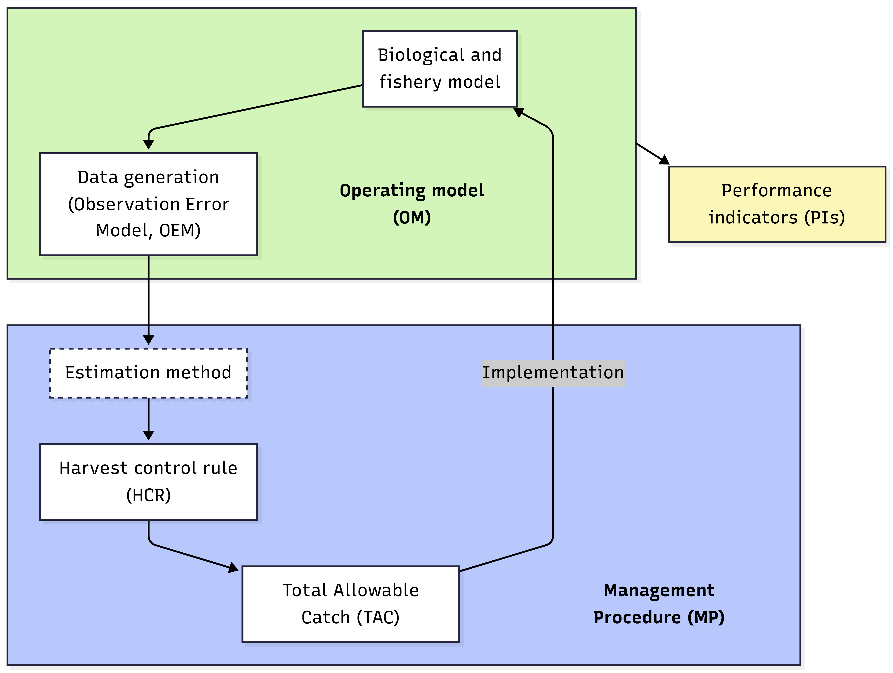{#fig-mse}

### About this document

This document describes the specifications for the OMs, CMPs, and PIs that have been proposed and developed for the N-ALB fishery. It is a living document and will be continued to be updated so that it reflects the current state of the N-ALB MSE process. Members of the Albacore Species Group (ALBSG) are encouraged to provide feedback, comments, or edits to any part of this document.

The document is written using the [Quarto](https://quarto.org/) format and can edited in any text editor. The source document is available on the [MSE GitHub repository](https://github.com/ICCAT/nalb-mse-2). ALBSG members can make edits to the document either directly in the online repository or by cloning the repository and submitting pull requests with their edits. Alternatively, they can email questions or comments to [the MSE developers](mailto:aurtizberea@azti.es). The former approach has the advantage that all comments, questions, and edits are immediately visible to all members of the ALBSG. The [Discussions feature](https://docs.github.com/en/discussions/quickstart#creating-a-new-discussion) on the Github repository can also be used to post questions, comments, or points for discussion related to any aspect of this document or the MSE process in general.

This document is available at the [N-ALB MSE homepage](https://iccat.github.io/nalb-mse-2/).

## MSE framework

The R software has been used to developed the MSE code for the N-ALB fishery. All code is open-source and can be found on the [MSE GitHub repository](https://github.com/ICCAT/nalb-mse-2). 

The code developed for the N-ALB MSE uses the [FLBEIA](https://github.com/flr/FLBEIA) framework. FLBEIA [@garciaFLBEIASimulationModel2017] is an R package that has been developed for conducting bio-economic evaluation of fisheries management strategies. The software allows the bio-economic evaluation of a wide range of management strategies in a great variety of case studies such as multi-stock, multi-fleet, stochastic and seasonal configurations. FLBEIA is built using FLR libraries. [FLR](https://flr-project.org/) is a collaborative project oriented to develop quantitative fisheries management tools.

## Stock assessment

Previously, the N-ALB OMs were based on the 2013 stock assessment [@merinoPreliminaryStockAssessment2014; @merinoUpdatedConsolidatedReport2020] using the MULTIFAN-CL platform [@fournierMULTIFANCLLengthbasedAgestructured1998].

A new stock assessment was conducted in 2023 [@iccatReport2023ICCAT2023] using the Stock Synthesis (SS3) platform [@methotStockSynthesisBiological2013]. The N-ALB OMs have been updated based on this new assessment.

The data used in the 2023 N-ALB assessment as well as the structure and assumptions of the assessment model are summarized in the sections below.

```{r}
#| label: tbl-fleet
#| tbl-cap: Fishing fleets included the 2023 N-ALB stock assessment. The last column indicates if the fleet had an associated index of abundance (catch-per-unit-effort, CPUE).
my_tab = readRDS('../tables/FleetInfo.rds')
my_tab |> gt() |>
  cols_label(Fleet = "Fleet code",
             CPUE = "CPUE included?") |>
  tab_style(style = list(cell_text(weight = "bold")),
            locations = cells_column_labels())
```

### Data

The period covered was from 1930 to 2021. The assessment mainly used landings data from longline (LL) and baitboat (BB) fleets, with a total of 15 fleets included in the model (@tbl-fleet and @fig-data). There were seven LL and one BB (Spain and France) catch-per-unit-effort (CPUE) indices (@fig-cpue). The catchability coefficients for the CPUE indices were assumed to be time-invariant.

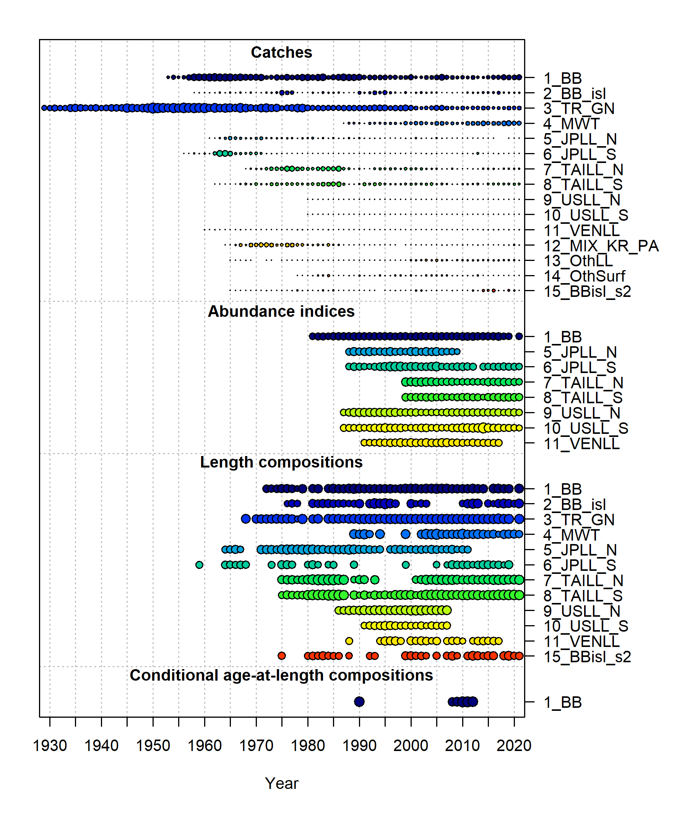{#fig-data width="80%"}

Length composition data from 12 fleets were included in the model, mostly from LL and BB fleets and for the period after 1970 (@fig-data). The effective sample size (ESS) for the length composition data was established by adjusting ESS until unity was reached between modeled ESS and the Francis suggested sample size [@francisDataWeightingStatistical2011]. Conditional age-at-length (CAAL) data was also included for the BB (France and Spain) fleet.

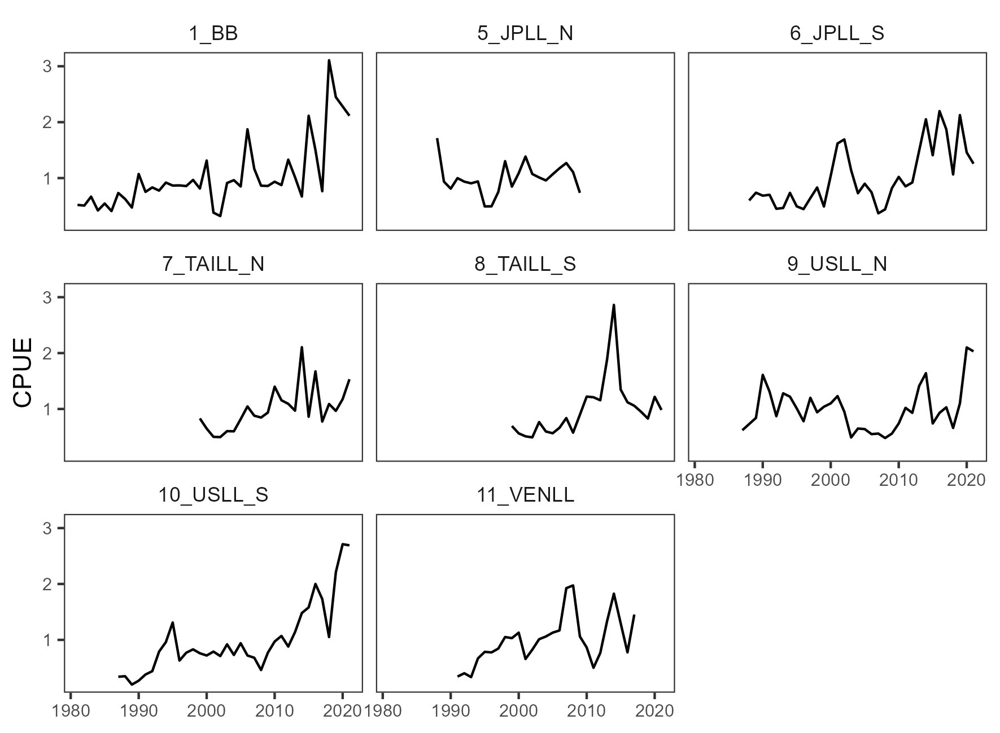{#fig-cpue}

### Model structure

The model was configured yearly (one season per year), one sex, one area, and a total of 16 age groups (0 to 15+). The spawning timing was January 1st.

### Biological Parameters

Natural mortality (M) was age-specific and parametrized following @lorenzenRelationshipBodyWeight1996, with a reference M equal to 0.36 for age 6 based on the assumption of a maximum age of 15 years [@hamelDevelopmentConsiderationsApplication2022]. Maturity-at-age was knife-edge, with 50% at age-5 and 100% thereafter. Fecundity was proportional to body weight. Growth was parametrized following the von Bertalanffy curve [@schnuteVersatileGrowthModel1981] and parameters were estimated within the model. Variability of lengths-at-age was assumed to be a function of age. @fig-biology shows a summary of the biological parametrization.

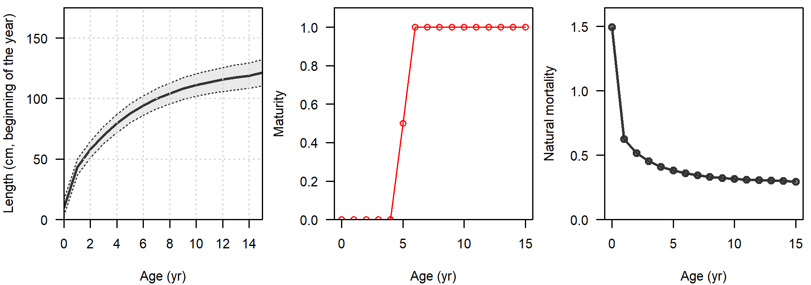{#fig-biology}

### Stock-Recruitment

Expected recruitment to age-0 was calculated from the total spawning stock biomass using the Beverton-Holt stock-recruit function. Recruitment settlement was assumed to occur at month 6. The standard error for the log-normally distributed recruitment deviations (sigmaR) was fixed to 0.4. Steepness (h) was estimated within the model with a prior of 0.75 taken from the 2013 assessment.

### Selectivity

Selectivity was modelled as a function of length. Dome-shaped selectivity was allowed for several LL and BB fleets, while an asymptotic selectivity was speficied for the US and Venezuela LL fleets. Splines were also used for the BB (Spain and France) and mid-water trawl. Time blocks were specified for some fleets due to changes in length composition data.

## Operating Models

### Reference OMs

During 2023 and 2024, the ALBSG developed a set of OMs considering variations in natural mortality (*M*), variability in recruitment (*sigmaR*), and the weighting of the following data sources:

-   Base case (no change)
-   Upweight ($\lambda=2$) CPUE data
-   Upweight ($\lambda=2$) size (i.e., length composition) data
-   Upweight ($\lambda=2$) age (i.e., CAAL) data

Per weighting scenario, 400 models were run in SS3 by randomly varying the M and sigmaR values sampled from a normal distribution with mean 0.36 and 0.4, respectively, and a coefficient of variation of 0.2 (@fig-pars).

{#fig-pars width="85%"}

<!-- 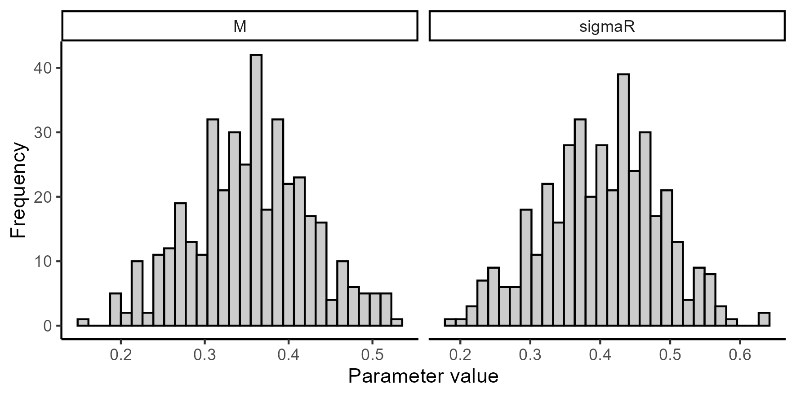{#fig-parsamp} -->

Then, 100 models per weighting scenario were selected based on maximum gradient, likelihood, and the ratio of virgin and spawning biomass values in order to remove unrealistic or nonconvergent runs. We consider this final set of 400 models (100 models per weighting scenario) as our Reference OMs.

### Robustness OMs

The robustness scenarios explored the impacts of changes in $R_0$ and recruitment variability:

- Changes in $R_0$: decrease in the $R_0$ parameter of the Beverton-Holt relationship by 20% in the simulation period from the estimated values in the Reference OMs.

- Changes in sigmaR: increase in the recruitment variability by 20% in the simulation period from the estimated values in the Reference OMs.

Robustness scenario are currently under development.

### Validation

#### Summary Report

A [Summary Report](om_report/om_report.html) summarizes the estimated parameters, the calculated biological reference points, and the estimated stock status relative to those reference points, across the 400 Reference OMs.

#### Diagnostic Reports

Individual diagnostic reports with objective function values and plots of model fits and patterns in residuals are available for each of the 400 Reference OMs. @tbl-omcheck presents the diagnostics for a subset of four OMs per weighting scenario with the most extreme M and sigmaR values.

```{r}
#| label: tbl-omcheck
#| tbl-cap: OM diagnostics reports. A set of four OMs were chosen per weighting scenario with the most extreme M and sigmaR values.
my_tab = read.csv('../tables/selected_OM.csv')
url_links = paste0("om_check/OM_", my_tab$mod_type, "_", my_tab$iter, ".html")
my_tab = my_tab %>% select(-iter)
my_tab$M = round(my_tab$M, digits = 2)
my_tab$sigmaR = round(my_tab$sigmaR, digits = 2)
my_tab$diag = url_links
desc_vec = expand.grid(c('Smallest', 'Medium', 'Largest'), c('M', 'sigmaR'))
desc_vec = paste(desc_vec$Var1, desc_vec$Var2, 'value')
my_tab = my_tab %>% mutate(description = rep(desc_vec, times = 4), .before = 'M')
my_tab |> gt(rowname_col = "description", groupname_col  = "mod_type") |> fmt_url(columns = 'diag', label = "See diagnostics",
                          color = 'blue')  |>
  cols_label(mod_type = "Weighting",
             M = "M",
             sigmaR = "sigmaR",
             diag = "")  |>
  tab_style(style = list(cell_text(weight = "bold")),
            locations = cells_column_labels()) |> 
  tab_options(table.width = "75%")
```

### Conditioning

The Reference OMs were conditioned in FLBEIA with the same biological configuration and fleet structure of the SS3 models (@tbl-fleet). Two main periods are modelled in the MSE framework: historical and simulation periods (@fig-time), with important differences in the data generation and observation error model (OEM).

```{mermaid}
%%| label: fig-time
%%| fig-cap: Periods in the MSE and main differences between them.
timeline
    section 1930 - 2026
        Historical period : - Catches from observations <br> - CPUE from OEM
    section 2027 - 2057
        Simulation period : - Catches from HCR <br> - CPUE from OEM <br> - Evaluate CMPs through PIs
```

#### Observation error model

Autocorrelation in CPUE residuals were introduced in the simulations based on a previous analysis of CPUE residuals in the stock assessment model (@tbl-cpue-rho). This observation error was introduced both in the historical and projection period for all the Reference OMs.

```{r}
#| label: tbl-cpue-rho
#| tbl-cap: Evaluation of temporal autocorrelation in CPUE residuals for lag 1. $\rho$ and $\sigma$ represent the correlation parameter and the standard deviation of residuals, respectively. ACF is the autocorrelation function. The only fleet that assumed a $\rho=0$ in the MSE was $1\_BB$.
mytab = readRDS('../tables/OEM_residuals.rds')
mytab$include = c('No', rep('Yes', times = 7))
mytab$include_proj = c('No', rep('Yes', times = 6), 'No')
mytab = mytab %>% select(-c(lag, sig_level))
mytab |> gt() |>
  cols_label(Fleet = "Index",
             rho = html("\u3C1"),
             sigma = html("\u3C3"),
             sig_acf = "Sign. ACF?",
             include = md("Autocorrelation <br> in MSE?"),
             include_proj = md("Included in MSE <br> projection period?")) |>
  tab_style(style = list(cell_text(weight = "bold")),
            locations = cells_column_labels()) |> 
  tab_options(table.width = "75%")
```

## Candidate Management Procedures

The management advice is given every three years (*management period*) and the total allowable catch (TAC) is derived from the candidate MP. The candidate MP was run in the last year of each management period, including information up to the previous year. The TAC derived from the MP was set for the next management period (@fig-timeline).

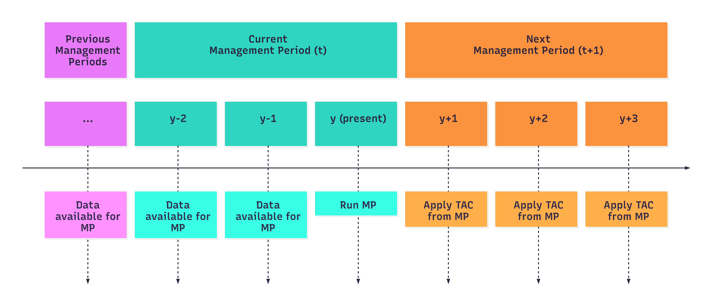{#fig-timeline}

### Pseudo-constant catch {#sec-mp-pcc}

The total allowable catch (TAC) for the next management period ($t+1$) is assumed constant, unless a reference value ($I_{G}$) derived from a group of indices of abundance in the last two years falls below a reference value $I_{ref}=0.91$ (value observed in 2010, when $SSB>SSB_{msy}$):

$$TAC_{t+1} =
\begin{cases}
TAC_{max}, & \text{if }I_{G} \geq I_{ref} \\
TAC_{max}(\frac{I_{G}}{I_{ref}}), & \text{if }I_{G} < I_{ref}
\end{cases}$$

where $TAC_{max}=42,000$ tonnes (@fig-pcc). $I_{G}$ was calculated as follows:

$$I_G = exp(\frac{1}{n_i}\sum_{i}log(I^*_i))$$

where $n_i$ is the number of selected indices of abundance and $I^*_i$ was calculated for every selected index of abundance $I_i$ using information from the last two years ($y-1$ and $y-2$):

$$I^*_i = \frac{I_{i,y-1}+I_{i,y-2}}{2}$$

For this case, the selected indices of abundance $I_i$ were (see @tbl-fleet for fleet description):

-   $1\_BB$
-   $6\_JPLL\_S$
-   $7\_TAILL\_N$
-   $8\_TAILL\_S$
-   $9\_USLL\_N$
-   $10\_USLL\_S$

In addition, the TAC variation between consecutive management periods $TAC_{t+1}$ and $TAC_{t}$ could not exceed 15% when $I_G < I_{ref}$.

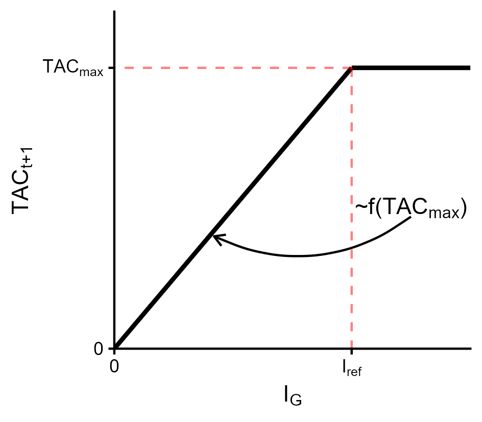{#fig-pcc width="55%"}

### Index-based

TAC for the next management period $t+1$ is calculated as a function of the current TAC ($TAC_{t}$):

$$TAC_{t+1} =
\begin{cases}
TAC_{t}, & \text{if }(1-\alpha)I_{ref} \leq I_{G} \leq (1+\alpha)I_{ref} \\
(1+\beta)TAC_{t}, & \text{if }I_{G} > (1+\alpha)I_{ref} \\
(1-\beta)TAC_{t}, & \text{if }I_{G} < (1-\alpha)I_{ref}
\end{cases}$$

where we assumed $\alpha=0.15$ and $\beta=0.15$ (@fig-ibased). $I_{G}$ was calculated as specified in @sec-mp-pcc. For this case, $I_{ref}=1$ (value observed in 2012, when $SSB>SSB_{msy}$). 

In addition, $TAC_{t} = TAC_{max}$ when $TAC_{t} > TAC_{max}$, assuming that $TAC_{max} = 50,000$ tonnes. Also, the TAC variation between consecutive management periods $TAC_{t+1}$ and $TAC_{t}$ could not exceed 15%.

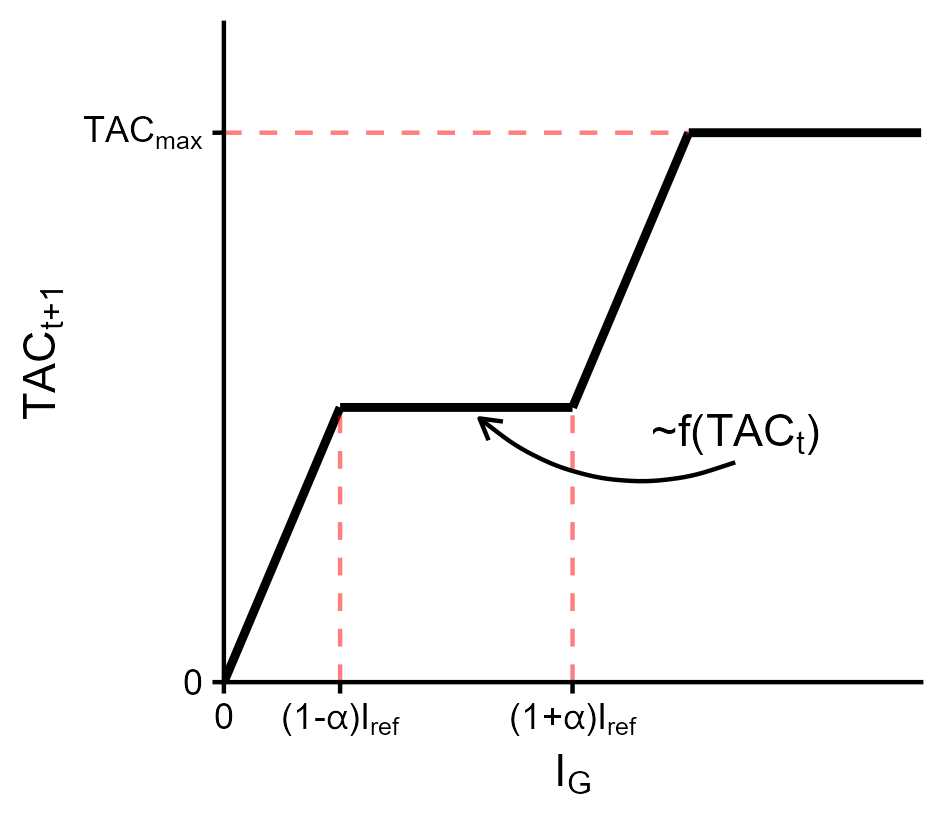{#fig-ibased width="55%"}

### Model-based

Simulated data was included in a stochastic surplus production model in continuous time (SPiCT). SPiCT is a full state-space model, where biomass and fishing dynamics are modelled as states, which are observed indirectly through biomass indices and commercial catches sampled with error [@pedersenStochasticSurplusProduction2017]. SPiCT calculates maximum sustainable yield (MSY) reference points and is able to make short-term projections. SPiCT is the estimation method in the MSE.

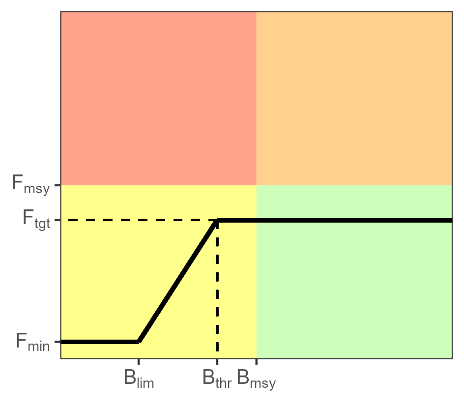{#fig-hcr width="50%"}

TAC is derived from a harvest control rule based on stock status estimate (@fig-hcr). In the HCR, $F_{tgt}$ and $B_{thr}$ need to be defined, and the following options were tested (@fig-combs):

- $F_{tgt}=0.8F_{msy}$ and $B_{thr}=B_{msy}$
- $F_{tgt}=F_{msy}$ and $B_{thr}=B_{msy}$

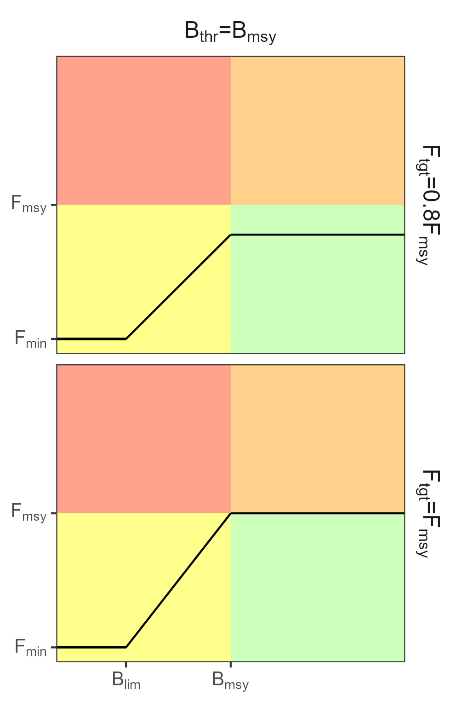{#fig-combs width="55%"}

In addition, $B_{lim}=0.4\times B_{msy}$ and $F_{mim}=0.1\times F_{msy}$ for all cases. These MPs were divided into two groups, depending on the maximum allowed variation between $TAC_{t+1}$ and $TAC_{t}$: 

- Maximum increase or decrease of 10%
- Maximum increase of 25% and decrease of 20%

## Performance Indicators

15 PIs have been developed for the N-ALB MSE (@tbl-pm) and are calculated in the simulation period. These PIs are grouped into four types: 

- **Status**: indicators related to stock status 

- **Safety**: indicators related to the probability of the stock not falling below the biological reference points

- **Yield**: indicators related to the catch in the projection years

- **Stability**: indicators related to the variation in the catches or TAC between management cycles

Each PI was calculated for every Reference OM (i.e., 400 PIs). Examples of each PI is given below.

| Type | Metric | Symbol | Description |
|-----------------|-------------------|-----------------|-------------------|
| Status | Minimum spawner biomass relative to $B_{msy}$ | $minB$ | $min(B_y/B_{msy})$ |
| Status | Mean spawner biomass relative to $B_{msy}$ | $meanB$ | $(\prod_y B_y/B_{msy})^{1/n_y}$ |
| Status | Mean fishing mortality relative to $F_{msy}$ | $meanF$ | $(\prod_y F_y/F_{msy})^{1/n_y}$ |
| Status | Probability of being in the Kobe green quadrant | $PGK$ | Proportion of years in green quadrant (see @fig-hcr) |
| Status | Probability of being in the Kobe red quadrant | $PRK$ | Proportion of years in red quadrant (see @fig-hcr) |
| Safety | Probability of $B>B_{lim}$ | $PBlim$ | Proportion of years that $B>B_{lim}$ |
| Safety | Probability of $B_{lim}<B<B_{msy}$ | $PBmsy$ | Proportion of years that $B_{lim}<B<B_{msy}$ |
| Yield | Mean catch (short term) | $Cstr$ | Mean catch from 1 to 3 years |
| Yield | Mean catch (medium term) | $Cmed$ | Mean catch from 5 to 10 years |
| Yield | Mean catch (long term) | $Clon$ | Mean catch from 15 to 25 years |
| Stability | Mean absolute proportional change (%) in catch | $Cc$ | Mean of $\mid\frac{C_y - C_{y-1}}{C_{y-1}}\mid$ |
| Stability | Standard deviation in catch | $Csd$ | Catch standard deviation |
| Stability | Probability of shutdown | $PShw$ | Proportion of management periods that TAC=0 |
| Stability | Probability of TAC change above 10% | $PTcx$ | Proportion of management cycles when the ratio of change $\frac{TAC_{t+1} - TAC_{t}}{TAC_{t}} > 10\%$ |
| Stability | Maximum amount of TAC change between management periods | $Tcmax$ | Maximum ratio of TAC change |

: Performance indicators and description. These indicators were calculated from the simulation period. {#tbl-pm}

### Examples

#### Status

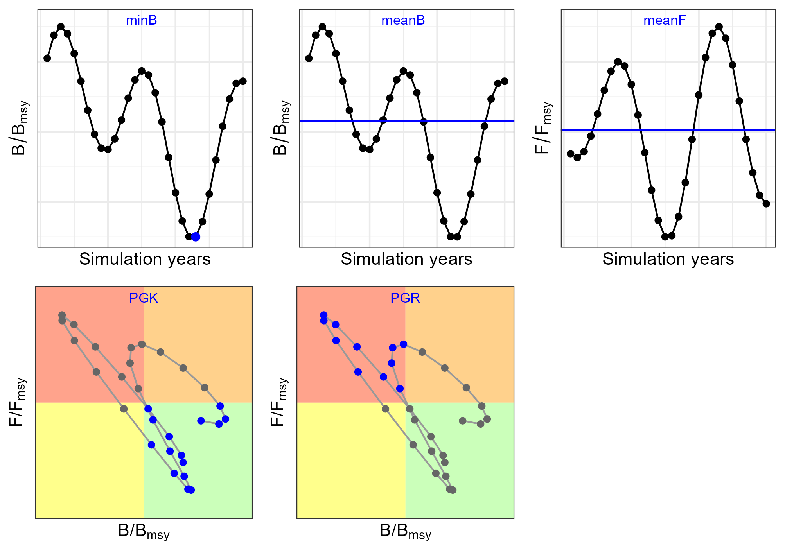{#fig-pm-status}

#### Safety

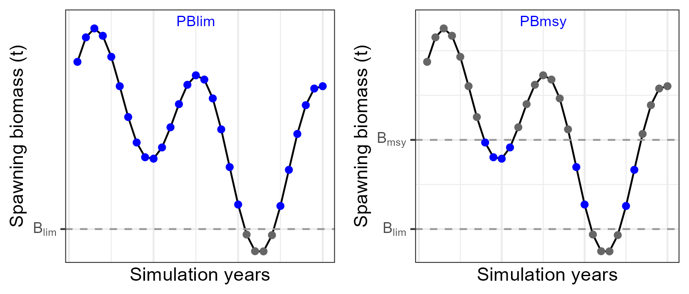{#fig-pm-safety}

#### Yield

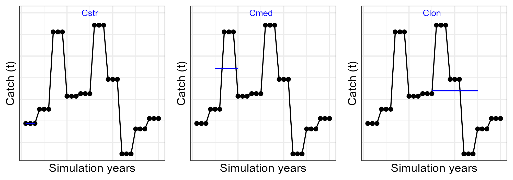{#fig-pm-yield}

#### Stability

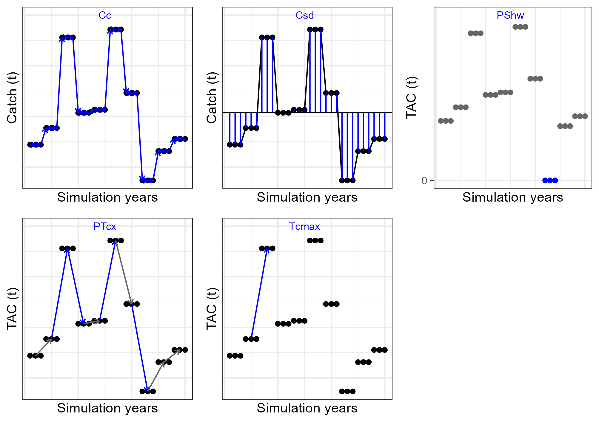{#fig-pm-stability}

<!-- ## Results -->

<!-- ### Performance indicators -->

<!-- ```{r} -->
<!-- #| label: tbl-pm-summ -->
<!-- #| tbl-cap: Performance indicators results. Numbers indicate the median over the 400 PMs calculated per HCR and OM. The color scale is independent for every column. -->
<!-- source("../tables/make_tables_pm.R") -->
<!-- source("../figures/make_figures_pm.R") -->
<!-- mytab = readRDS('../tables/PM_summary.rds') -->
<!-- attach_excel <- mytab %>% -->
<!--   download_this( -->
<!--     output_name = "PerfMetrics", -->
<!--     output_extension = ".xlsx",  -->
<!--     button_label = "Download Excel", -->
<!--     button_type = "primary"  -->
<!--   ) -->
<!-- mytab |> ungroup() |> gt() |>  -->
<!--   tab_spanner(label = md("**Status**"),  -->
<!--               columns = c('minB', 'meanB', 'meanF', 'pGreen', 'pRed')) |> -->
<!--   tab_spanner(label = md("**Safety**"),  -->
<!--               columns = c('pBlim', 'pBmsy')) |> -->
<!--   tab_spanner(label = md("**Yield**"),  -->
<!--               columns = c('Csht', 'Cmed', 'Clon')) |> -->
<!--   tab_spanner(label = md("**Stability**"),  -->
<!--               columns = c('Cc', 'Csd', 'pShw', 'pTX', 'maxTc')) |> -->
<!--   fmt_number(decimals = 2) |> -->
<!--   fmt_number(columns = c("Clon", "Cmed", "Csht", "Csd"), decimals = 0) |> -->
<!--   fmt_percent( -->
<!--      columns = c("pGreen", "pRed", "pBlim", "pBmsy", "Cc", "pShw", "pTX", "maxTc"), -->
<!--      decimals = 0 -->
<!--   ) |>  -->
<!--   cols_label(Ftgt = md("**F<sub>tgt</sub>**"), -->
<!--              Btgt = md("**B<sub>thr</sub>**")) |> -->
<!--   data_color(method = "numeric", palette = c("#ffffff", "#000000")) |>  -->
<!--   tab_source_note(attach_excel)  -->
<!--   # opt_interactive(use_filters = TRUE, use_pagination = FALSE, use_sorting = FALSE) -->
<!-- ``` -->

<!-- ```{r} -->
<!-- #| label: tbl-pm-summ-robust -->
<!-- #| tbl-cap: Performance indicators results for robustness scenarios. Numbers indicate the median over the 400 PMs calculated per HCR and OM. The color scale is independent for every column. -->
<!-- mytab = readRDS('../tables/PM_summary_robust.rds') -->
<!-- attach_excel <- mytab %>% -->
<!--   download_this( -->
<!--     output_name = "PerfMetrics_Robust", -->
<!--     output_extension = ".xlsx",  -->
<!--     button_label = "Download Excel", -->
<!--     button_type = "primary"  -->
<!--   ) -->
<!-- mytab |> ungroup() |> gt() |>  -->
<!--   tab_spanner(label = md("**Status**"),  -->
<!--               columns = c('minB', 'meanB', 'meanF', 'pGreen', 'pRed')) |> -->
<!--   tab_spanner(label = md("**Safety**"),  -->
<!--               columns = c('pBlim', 'pBmsy')) |> -->
<!--   tab_spanner(label = md("**Yield**"),  -->
<!--               columns = c('Csht', 'Cmed', 'Clon')) |> -->
<!--   tab_spanner(label = md("**Stability**"),  -->
<!--               columns = c('Cc', 'Csd', 'pShw', 'pTX', 'maxTc')) |> -->
<!--   fmt_number(decimals = 2) |> -->
<!--   fmt_number(columns = c("Clon", "Cmed", "Csht", "Csd"), decimals = 0) |> -->
<!--   fmt_percent( -->
<!--      columns = c("pGreen", "pRed", "pBlim", "pBmsy", "Cc", "pShw", "pTX", "maxTc"), -->
<!--      decimals = 0 -->
<!--   ) |>  -->
<!--   cols_label(Scen = md("**Scen**"), -->
<!--              Ftgt = md("**F<sub>tgt</sub>**"), -->
<!--              Btgt = md("**B<sub>thr</sub>**")) |> -->
<!--   data_color(method = "numeric", palette = c("#ffffff", "#000000")) |>  -->
<!--   tab_source_note(attach_excel)  -->
<!--   # opt_interactive(use_filters = TRUE, use_pagination = FALSE, use_sorting = FALSE) -->
<!-- ``` -->

<!-- 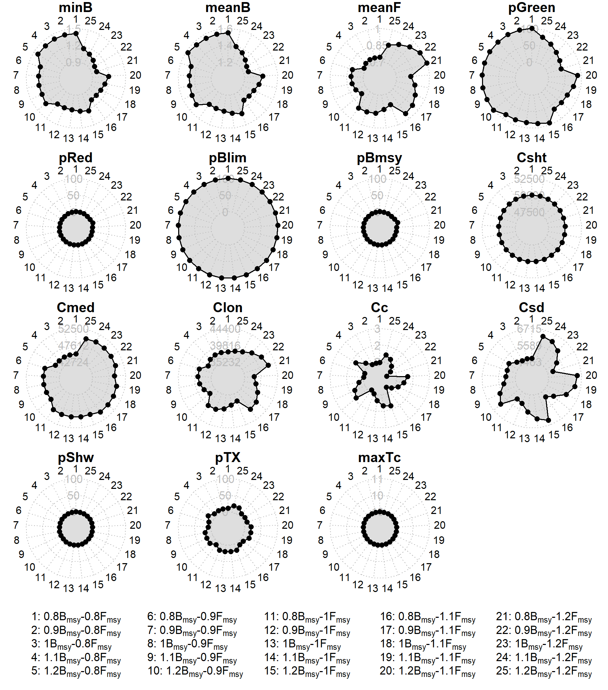{#fig-pm-radar} -->

## Glossary

| Term   | Definition        |
|--------|-------------------|
| N-ALB     | North Atlantic Albacore   |
| OM     | Operating model   |
| CMP    | Candidate management procedure   |
| PI     | Performance indicator   |
| ALBSG  | Albacore Species Group   |
| SS3  | Stock Synthesis 3 platform   |
| ESS  | Effective sample size   |
| CAAL  | Conditional age-at-length   |
| M  | Natural mortality   |
| sigmaR  | Variability in recruitment   |
| h  | Steepness in the stock-recruit function   |
| OEM  | Observation error model   |
| HCR  | Harvest control rule   |
| TAC  | Total Allowable Catch  |

## References {.unnumbered}
